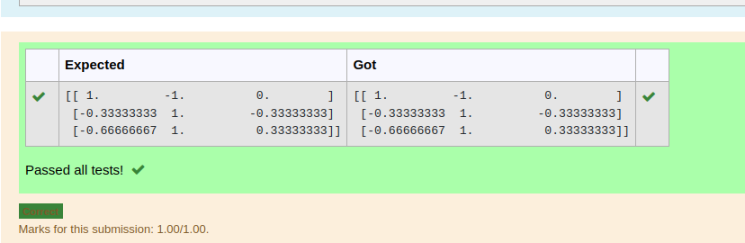

# INVERSE-OF-A-MATRIX
## Aim:
To write a python program to find the inverse of a matrix
## Equipment’s required:
1. 	Hardware – PCs
2. 	Anaconda – Python 3.7 Installation / Moodle-Code Runner
## Algorithm:
### Step1 :  importing the function as, import numpy as np
### Step 2: taking input by using ,np.array([])
### Step 3: Using the np.linalg.inv(), we can find the inverse of the given matrix.
### Step 4: then print the variable given for step 3

## Program:
``` python
#Program to find the inverse of a matrix.
#Developed by: SASI RAJ KUMA T J
#RegisterNumber: 22005240
import numpy as np
A = np.array([[2,1,1],[1,1,1],[1,-1,2]])
rank=np.linalg.inv(A)
print(rank)
```
## Output:

## Result:
Thus the inverse of given matrix is successfully solved using python program

